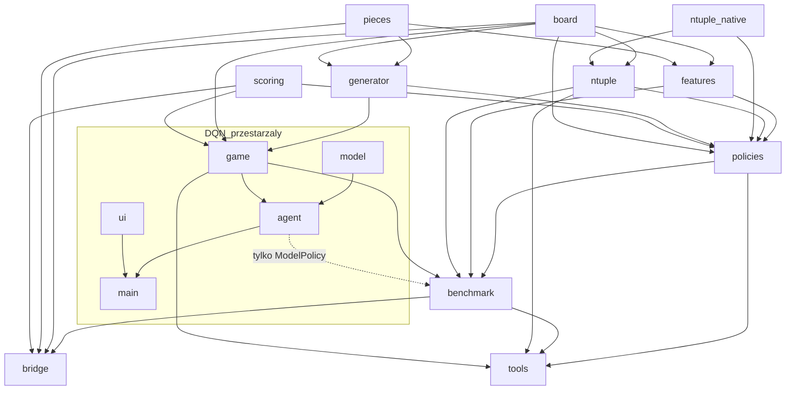
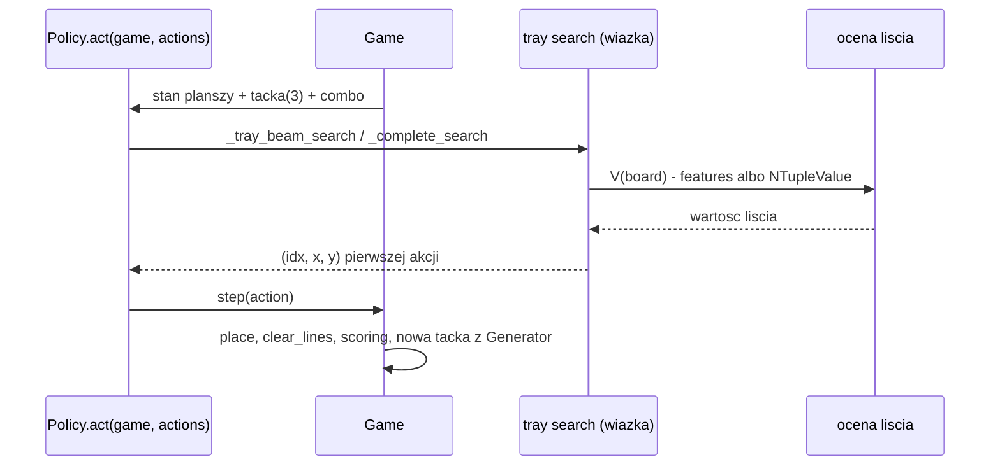
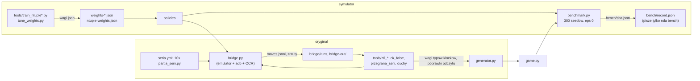
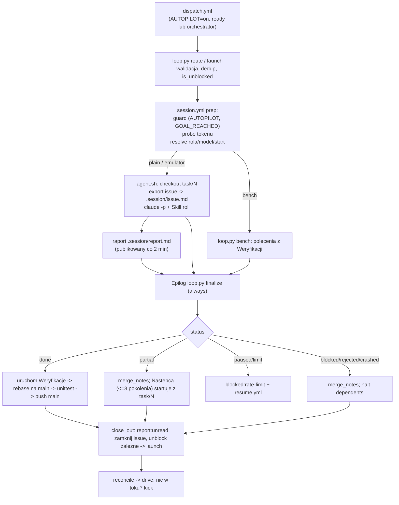
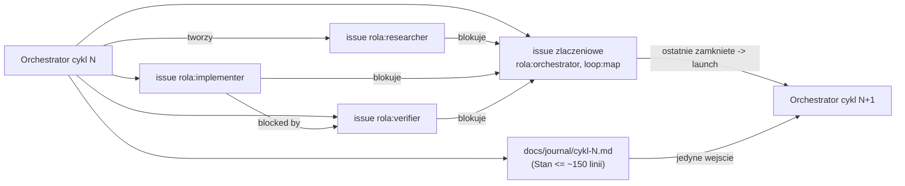

# Architektura kodu i pętli: moduły, role, przepływ (#369, mapa #361)

Opis z czytania repo na gałęzi `research/architektura` (start z `main`, `06f9f31`). Źródłem jest tylko kod,
skille, workflow i `CONTEXT.md` w repo; żadnych pomiarów na żywych sesjach, nic z sieci.
`[K]` = odczytane z pliku (podaję plik), `[Z]` = wniosek ze źródeł, nie zapis w nich. Rozmiary to `wc -l`.
Diagramy są surowe (mermaid), do przerysowania.

## Streszczenie

- Repo to dwie warstwy: **kod gry i agenta** (korzeń, ~5,9 tys. linii `*.py`, plus `tools/` 10,1 tys. i `tests/` 10,9 tys.)
  oraz **pętla agentowa** (`.github/` + `.claude/`), która ten kod rozwija bez człowieka.
- Silnik gry (`board`, `pieces`, `scoring`, `generator`, `game`) nie zależy od niczego poza sobą. Wszystko inne
  (polityki, benchmark, most, narzędzia) jest nad nim. [K]
- Grający agent to dziś **przeszukanie tacki z wiązką + ocena liścia N-tuple** (`policies.NTupleLookaheadPolicy`),
  nie sieć neuronowa. DQN (`agent.py`, `model.py`, `main.py`, `ui.py`) to martwy punkt startowy; żywo trzyma go tylko
  gałąź `ModelPolicy` w `benchmark.build_policy`. [K]/[Z]
- Pętla to sztywny skrypt (`loop.py`, 850 linii, zero agenta) wołający sesje Claude Code w Actions. Role = skill + profil,
  graf zadań = issues z krawędziami „blocked by", pamięć = `docs/journal/`. [K]
- Stan: `GOAL_REACHED` istnieje (cykl 60, 2026-10-02): pętla stoi do skasowania pliku przez człowieka. [K] `GOAL_REACHED`

## (a) Kod

### Warstwy i rozmiary

| Warstwa | Pliki (linie) | Rola |
|---|---|---|
| Silnik | `board.py` 131, `pieces.py` 98, `scoring.py` 37, `generator.py` 87, `game.py` 134 | reguły, punkty, generator tacek, `Game` (reset/step/apply_placement) |
| Ocena planszy | `features.py` 224, `ntuple.py` 432, `ntuple_native.py` 476 + `ntuple_native.c` | ręczne cechy bitowe; LUT N-tuple po łatach; rdzeń C przez ctypes |
| Polityki | `policies.py` 794 | `Random`, `Greedy`, `Heuristic`, `Tray`, `Lookahead`, `NTupleLookahead`, `ModelPolicy` |
| Pomiar | `benchmark.py` 684, `bench/` (145 plików: rekordy, `config.json`, `record.json`) | definicja z #8: stałe i rotowane seedy, ε = 0, sufit ruchów |
| Most do oryginału | `bridge.py` 1408 (+ `bridge_digits*.npz`, `bridge/runs/`) | zrzut ekranu → stan → polityka → `adb input` |
| Narzędzia | `tools/` 43 pliki (np. `train_ntuple*.py` 801/430, `tune_weights.py`, `partia_serii.py`, `ok_false.py` 653, `z6_*.py`, `*.sh`) | uczenie, kalibracja, serie na oryginale, analizy |
| Testy | `tests/` 56 plików, 10,9 tys. linii | `unittest discover -s tests` |
| DQN (przestarzały) | `agent.py` 493, `model.py` 201, `main.py` 47, `ui.py` 111, `helper.py` 32, `test_agent.py` 465, `run_single_test.py` | punkt startowy sprzed pętli; `torch`, `pygame`, `matplotlib` |

`generator.py` ma model wag typów klocków zmierzonych z mostu (#186) i tryb świadomy planszy (#221); `Game(seed,
legacy_generator=True)` odtwarza starą sekwencję bit w bit (`game.py`, docstring). [K]

### Zależności modułów

Kierunek strzałki: „importuje". Wyciągnięte z `import`/`from` w nagłówkach plików. [K]

Uwagi do grafu:

- `tests/test_engine.py` jako jedyny test sięga po `agent`/`torch`; pozostałe testy nie. [K] (`grep torch`)
- `policies.py` sięga do prywatnych `_simulate_placement`/`_placement_gain`, a `tools/train_ntuple.py` importuje je stąd
  (`from policies import _placement_gain, _simulate_placement`). To ukryte sprzężenie narzędzia z polityką. [K]
- `bridge.py` importuje z `benchmark` tylko `build_policy`: most gra **dokładnie tą samą polityką**, którą mierzy benchmark,
  wybraną napisem (argv[2] / `BRIDGE_POLICY`). [K]
- 23 pliki w `tools/` i `tests/` importują `benchmark`. [K] (`grep -l`)

### Przepływ danych w grze (jeden ruch)

- `LookaheadPolicy` = `TrayPolicy` + jeden poziom losowy nad następną tacką (próbki z `Generator`).
  `NTupleLookaheadPolicy` podmienia tylko `_leaf_value` na sumę LUT-ów N-tuple z samej planszy (bez członu combo, decyzja #125).
  `policies.py` ma też wariant natywny (`_tray_beam_search_native`, rdzeń C) z awaryjnym powrotem na Pythona,
  gdy brak kompilatora lub `NTUPLE_NATIVE=0`. [K] (`policies.py`, `ntuple_native.py` docstring)
- `benchmark.build_policy(spec)` rozpoznaje: `random`, `greedy`, `heuristic`, `tray`, `lookahead`, `heuristic:<plik>`,
  `tray:<plik>`, `lookahead:<plik>`, `lookahead-ntuple:<plik>[@parametry]`, albo ścieżkę do wag torcha. [K]

### Przepływ dwóch pętli danych

- Symulator jest kalibrowany z mostu (wagi typów klocków `docs/data/z6-pary.json` → `generator.py`), a polityka trenowana
  na symulatorze jest sprawdzana na oryginale. `bench/record.json` zawiera `source_hashes` (`game.py`, `scoring.py`,
  `generator.py`, `pieces.py`, `features.py`, `policies.py`…), więc zmiana symulatora unieważnia porównanie. [K] (`bench/record.json`)
- `bench/config.json`: 300 seedów, `move_cap` 64000, `epsilon` 0, próg 10%. [K]

## (b) Pętla

### Pojęcia (z `CONTEXT.md`)

Pętla (włącza człowiek zmienną repo `AUTOPILOT`), cykl (od jednego issue `rola:orchestrator` do następnego), sesja
(jedno uruchomienie agenta), ogniwo (przebieg workflow w łańcuchu jednej długiej sesji), epilog (krok `finalize`, działa
zawsze), dziennik (`docs/journal/cykl-NNNN.md`), `Stan` (ostatnia sekcja wpisu), awaria (stan spoczynku). [K] `CONTEXT.md`

### Role

Rola = skill (`.claude/skills/<rola>/SKILL.md`) + profil (`.claude/profiles.yml`), wybierane etykietą `rola:<nazwa>`. [K]

| Rola | Model / effort (domyślne) | Internet | Emulator | Zapis (allowlista) | Limity | Robi |
|---|---|---|---|---|---|---|
| `orchestrator` | opus-5-5 / high | nie | nie | `docs/journal/**`, `RAPORT.md`, `GOAL_REACHED`, `.claude/skills/**`, `.claude/profiles.yml`, `bench/config.json` | 150 tur, 120 min | planuje cykl, nie pisze kodu; jedyna rola z `gh` |
| `implementer` | sonnet-5-5 / medium | nie | nie | `**` | 100 tur, 240 min | zmienia kod |
| `researcher` | sonnet-5-5 / medium | tak | nie | `docs/research/**` | 80 tur, 120 min | raport z wiedzą spoza repo |
| `verifier` | sonnet-5-5 / medium | nie | tak | `bridge/runs/**` | 120 tur, 300 min | emulator, most, pomiary, serie |
| `bench` | brak (nie agent) | nie | nie | `bench/*.json`, `bench/record.json` | wg profilu | job liczący, jedyny pisarz rekordu |

Zakazy twarde (workflow): żaden profil nie ma naraz internetu i zapisu kodu; żaden nie sięga do `.github/`, skilla
orchestratora ani `bench/record.json` (poza `bench`). `PROTECTED_PREFIXES = (".github/", ".claude/skills/orchestrator/")`
w `loop.py:39`. Granica na ścieżkach jest dziś „społeczna" (skill), nie mechaniczna, poza odrzuceniem scalenia w epilogu.
Modelu i effortu nie zmienia sesja: robi to tylko orchestrator etykietami `model:opus` / `effort:high` (lista zamknięta). [K]

### Etykiety

| Etykieta | Kto nadaje | Znaczenie |
|---|---|---|
| `rola:<nazwa>` | orchestrator | wybiera skill i profil; dokładnie jedna na issue |
| `loop:iteration N` | orchestrator / pętla (następca, dozorca) | issue należy do pętli; bez niej pętla issue nie widzi |
| `loop:map` | orchestrator | issue złączeniowe = mapa cyklu |
| `pokolenie:N` | epilog | licznik następców, limit `MAX_GEN` = 3 |
| `report:unread` | epilog | raport czeka na orchestratora |
| `blocked:rate-limit` | epilog | sesja zaparkowana do `wznow_po` |
| `conflict` | epilog | konflikt przy rebase (limit 3) |
| `awaria` | orchestrator lub dozorca | zatrzymuje dispatch wszystkiego poza naprawą |
| `ready` | człowiek | wyzwala `dispatch.yml` ręcznie |
| `model:opus`, `effort:high` | orchestrator | nadpisanie modelu / effortu |

### Workflow i kod pętli

| Plik | Wyzwalacz | Co robi |
|---|---|---|
| `dispatch.yml` | `workflow_dispatch` (orchestrator), etykieta `ready` | jedyne publiczne wejście; woła `loop.py route` |
| `session.yml` | `workflow_dispatch` (issue) | `prep` (guard, probe, resolve) → job `plain` / `emulator` / `bench` → epilog `finalize` |
| `resume.yml` | z epilogu zaparkowanej sesji | job śpi do `wznow_po` (do 340 min), woła `launch` |
| `watchdog.yml` | cron co 30 min | dozorca: `loop.py watch` |
| `seria.yml` | ręcznie | 10 partii równolegle na emulatorze, bez agenta |
| `bridge.yml`, `emulator-probe.yml` | ręcznie | próby mostu i emulatora |

`loop.py` (850 linii) biegnie zawsze z checkoutu gałęzi domyślnej (`loop/`), agent pracuje w osobnym checkoutcie
(`work/`): agent nie może zmienić kodu, który go pilnuje. Podpolecenia: `guard`, `probe`, `route`, `resolve`, `export`,
`publish`, `finalize`, `bench`, `watch`, `resume`. `agent.sh` uruchamia `claude -p` z `--allowedTools` z profilu, filtrem
strumienia i checkpointem co 120 s (publikacja raportu + force-push `task/N`). Token `gh` dostaje wyłącznie orchestrator. [K]

### Cykl życia jednej sesji

Reguły epilogu `finalize` [K]:

- `done` bez zielonej `## Weryfikacji` (uruchamianej przez epilog) spada do `partial`.
- Scalenie odrzucone (`protected`), gdy zmiana dotyka `.github/`, skilla orchestratora lub `bench/record.json` (poza rolą `bench`).
- Konflikt rebase: ta sama sesja ponownie, do 3 razy, potem `crashed`.
- Testy po rebase (`unittest discover -s tests`) czerwone → `partial`.
- Niedokończona sesja scala tylko `RAPORT.md` i `docs/journal/` (`NOTES`), kod zostaje na `task/N`.
- Limit subskrypcji → `paused`, do 3 prób z terminem resetu albo backoff 1/5/24 h; wiek issue ≥ 30 dni → `crashed`.

Statusy raportu: `wip`, `done`, `partial`, `blocked`, `rejected` (stawia agent); `paused`, `crashed` (stawia epilog).
Pola `proby`, `wznow_po`, `kopniecia`, `kopniete`, `konflikty`, `przyczyna`, `weryfikacja` należą do epilogu i dozorcy.
Format: `.claude/skills/PROTOKOL-SESJI.md`.

### Cykl orchestratora i jak powstaje mapa zadań

Skill `orchestrator/SKILL.md` (319 linii). Kroki jednego cyklu: [K]

1. **Wejście na zimno:** czyta tylko `## Stan` najnowszego `cykl-NNNN.md`, otwarte `awaria`, raporty z `report:unread`.
2. **Zbiera wyniki:** ostatni komentarz z `<!-- session-report -->` od zaufanego autora; sprawdza to, co raport linkuje;
   ocenia w dzienniku, czy raport badawczy odpowiedział na pytanie; reaguje na `partial`/`rejected`/`blocked`/`crashed`.
3. **Decyzje własne:** kierunek algorytmiczny, nagroda, jedno zdanie o rokowaniu linii pracy w każdym cyklu.
4. **Pisze mapę:** każde zadanie to issue (`## Cel`, `## Kryteria akceptacji`, `## Weryfikacja`, `## Kontekst`, `## Budżet`),
   tylko orchestrator tworzy issues (poza następcą z epilogu i awarią dozorcy).
5. **Dobiera role** (`implementer`, `researcher`, `verifier`, `bench`; `bench` tylko gdy ktoś wyprodukował wagi).
6. **Wiąże krawędzie:** zadania na tych samych plikach i zależne od wyniku → natywne „blocked by"; **issue złączeniowe**
   (`rola:orchestrator`, `loop:map`) blokowane przez wszystkie inne issues cyklu. Zadania są jego sub-issues. Zamknięcie ostatniego
   zadania odblokowuje następny cykl: to mechanizm posuwania pętli.
7. **Rozpoczyna:** `gh workflow run dispatch.yml -f issue=N` tylko dla `blocked_by = 0`, sufit 12 jednoczesnych sesji;
   resztę rusza epilog po zamknięciu blokera (`unblock`).

Dziennik: pięć sekcji (`Zlecone`, `Liczby`, `Odkrycia i obalone założenia`, `Decyzja`, `Stan`), tylko `Stan` ma limit.
Jest 57 plików w `docs/journal/`. `RAPORT.md` (okno właściciela) nadpisywany w pierwszym cyklu, w którym ostatni commit pliku ma
≥ 7 dni. Budżet kontekstu orchestratora: domknąć mapę przy ~150 tys. tokenów, nigdy powyżej 200 tys. [K]

### Dozorca (watchdog) i zatrzymania

Dozorca to sztywny skrypt, bo dozorca-sesja mogłaby paść na tę samą chorobę. Co 30 min: `guard_ok` (AUTOPILOT, GOAL_REACHED,
awaria), sonda `CLAUDE_CODE_OAUTH_TOKEN` (401/403 → issue `awaria`), sprawdzenie `ASSETS_READ_TOKEN`, potem `drive`: [K]

- 3 sesje z rzędu `crashed` bez commita → `awaria`;
- zaparkowane po terminie → `resume`;
- brak zobowiązań w toku → `kick`: kopnięcie gotowych issues (limit 3 bezskutecznych → `awaria`);
- zero otwartych issues → nowy `rola:orchestrator` ze sztywnego szablonu („czysta śmierć to zator, nie sukces").

`commitments()` = pętla żyje, gdy jest przebieg w toku, park z terminem w przyszłości albo świeży dispatch (karencja 30 min).

### `AUTOPILOT`, `GOAL_REACHED`, `awaria`

| Mechanizm | Kto steruje | Skutek |
|---|---|---|
| `AUTOPILOT` (zmienna repo, `on`) | wyłącznie człowiek | bramka `guard` w każdym workflow; inna wartość niż `on` = stój (fail-safe) |
| `GOAL_REACHED` (plik w korzeniu) | orchestrator tworzy, człowiek kasuje | `guard_ok` zwraca fałsz: żadnych nowych sesji |
| `awaria` (etykieta) | orchestrator (ostateczność, 3 sekcje) lub dozorca | `awaria_open()` ucisza dozorcę i dispatch poza naprawą |

Cel (`SKILL.md`, „Cel i weryfikacja"): agent nie przegrywa. Warunek 1: 0 przegranych na 300 stałych seedach przy sufite
ruchów ≥ 10× potrzebnych do 1 mln licznika apki. Warunek 2: seria weryfikacyjna (`seria.yml`) 10 partii równolegle,
każda do 1 mln licznika apki, wszystkie w jednej serii. Oba warunki spełnione w cyklu 60 (warunek 1: #279, cykl 34; warunek 2:
seria s7), więc `GOAL_REACHED` blokuje pętlę. [K] `GOAL_REACHED`

## Czego tu nie ma / co zauważyłem

| Obserwacja | Status |
|---|---|
| DQN (`agent.py`, `model.py`, `main.py`, `ui.py`, `helper.py`, `test_agent.py`, `run_single_test.py`, ~1,4 tys. linii) wymaga `torch`/`pygame`, a grającą polityką jest N-tuple + przeszukanie; `session.yml` mimo to instaluje torcha w każdej sesji | `[Z]` kandydat do usunięcia; nie sprawdzałem, czy wagi `.pth` ktoś jeszcze mierzy |
| Korzeń ma ślady robocze: `wynik.prof`, `wyniki.prof`, `test_output.txt`, `training_stats*.csv`, `__pycache__`, `weights*.json` | `[K]` (`ls`) |
| `tools/` ma 43 pliki i 10,1 tys. linii, tyle co `tests/`; wiele to jednorazowe pomiary (`measure_*`, `z6_*`, `przeglad_*`) | `[K]` rozmiary; „jednorazowe" to `[Z]` z nazw |
| `tools/train_ntuple.py` importuje prywatne funkcje z `policies.py` | `[K]` |
| Granice ścieżek zapisu ról są społeczne, mechanicznie pilnuje tylko `PROTECTED_PREFIXES` w epilogu | `[K]` komentarz w `profiles.yml` |
